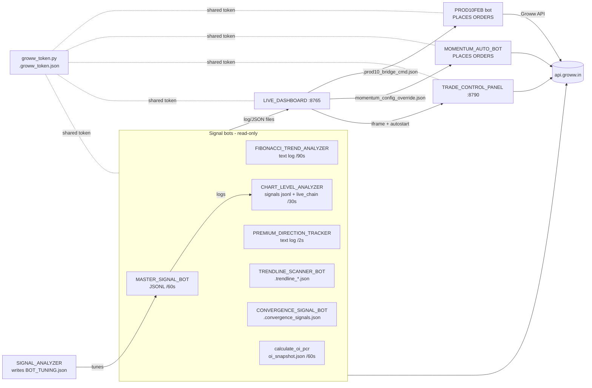

# REBUILD BLUEPRINT — Groww Options Trading Framework

**Purpose of this document:** if the codebase is ever lost, corrupted, or "disturbed", an AI
agent (or a human engineer) must be able to rebuild the ENTIRE framework end-to-end using only
this document set. It is written as instructions to that agent.

**Document set (all must survive together — commit them):**

| File | Contents |
|---|---|
| `REBUILD_BLUEPRINT.md` (this file) | Architecture, conventions, inter-process contracts, safety rules, rebuild order, acceptance tests, runbook |
| `docs/rebuild/01_PROD10FEB_TRADING_BOT.md` | Full spec of the order-placing manual bot: CONFIG, 4 trade modes, order flow, bridge protocol, ATR/SL math, known defects |
| `docs/rebuild/02_LIVE_DASHBOARD.md` | Full spec of the 8765 dashboard: every HTTP route, every file it reads/writes, bot registry, UI tabs, AI jobs, inline trade engine |
| `docs/rebuild/03_SIGNAL_ANALYZER_BOTS.md` | Full specs of the 7 signal/analyzer bots + SIGNAL_ANALYZER + PERSONAL_TRADING_AI: algorithms, thresholds, output contracts |
| `docs/rebuild/04_INFRA_AND_DATA_FILES.md` | groww_token, whatsapp_gateway, KEY_LEVELS, control panel, trading_decision_engine, instrument.csv, Excel files, every dotfile schema, logs layout, startup scripts |
| `GROWW_API_REFERENCE.md` | Every Groww/NSE API endpoint with headers, params, response shapes and curl examples |

Snapshot date: **2026-08-04** (version 1.4.0, commit `581421d`). All constants, filenames,
JSON keys, and even printed log strings in these documents are **exact contracts** — several
consumers regex-scrape other bots' log text, so wording changes break integrations.

---

## 0. How to use this document (instructions to the rebuilding agent)

1. Read §1–§6 of this file first — they define the global architecture and the contracts
   every component must honour.
2. Rebuild in the order given in §7. After each stage, run that stage's acceptance test
   before moving on. Do not reorder: later components read files earlier components write.
3. When implementing a component, open its spec file in `docs/rebuild/` and treat it as the
   requirements document. Where a spec lists a "known defect", implement the FIXED behaviour
   described there (the defect list exists so you don't reintroduce them, except where the
   spec says "preserve").
4. The safety rules in §6 are non-negotiable invariants. Every order-placing code path must
   satisfy all of them.
5. Secrets: never hardcode. All credentials live in `ai_config.json` (gitignored) — see §2.
   The legacy code hardcoded the Groww API key + TOTP secret in several bots; do NOT replicate.

---

## 1. What this system is

A personal intraday options-trading framework for Indian index options (NIFTY on NSE, SENSEX
on BSE, plus BANKNIFTY/FINNIFTY) using the **Groww** broker API. ~20 cooperating Python
processes on one macOS machine, communicating through **files** (JSON dotfiles + log files) —
no message bus, no database.

Three layers:

1. **Signal layer (read-only, never places orders):** MASTER_SIGNAL_BOT,
   FIBONACCI_TREND_ANALYZER, CHART_LEVEL_ANALYZER, PREMIUM_DIRECTION_TRACKER,
   TRENDLINE_SCANNER_BOT, CONVERGENCE_SIGNAL_BOT, calculate_oi_pcr, SIGNAL_MONITOR,
   KEY_LEVELS_TERMINAL, PERSONAL_TRADING_AI, SIGNAL_ANALYZER (self-tuning),
   trading_decision_engine (shadow mode).
2. **Execution layer (places real orders):** PROD10FEB_ManualBOT (the primary manual/quick
   bot, driven by dashboard clicks through a file bridge), MOMENTUM_AUTO_BOT (auto-trader),
   trading_decision_engine in `--mode live`.
3. **Control layer:** LIVE_DASHBOARD (web UI on **0.0.0.0:8765**, aggregates everything,
   sends commands to PROD10), TRADE_CONTROL_PANEL (emergency panel on **127.0.0.1:8790**,
   independent of everything else — positions, one-click exit, exit-all, curl generator).



---

## 2. Environment, credentials, dependencies

- macOS (darwin), Python 3.9 (`/Library/Developer/CommandLineTools/usr/bin/python3` or
  `.venv`), zsh. Terminal windows launched via AppleScript (`osascript`).
- `requirements.txt` (exact): `flask>=3.0.0, growwapi>=1.5.0, openai>=1.0.0, openpyxl>=3.1.0,
  pandas>=2.0.0, playwright>=1.50.0, pyperclip>=1.8.0, pyotp>=2.9.0, requests>=2.32.0,
  twilio>=9.0.0`. Also used at runtime: `numpy`, `yfinance` (optional), `playsound3`,
  `flask-cors`. AI narratives shell out to the `claude` CLI (Claude Code), optional.
- **`ai_config.json`** (repo root, gitignored) is the single credential store:
  ```json
  {
    "groww_api_key":     "<Groww API JWT>",
    "groww_totp_secret": "<base32 TOTP secret>",
    "openai_api_key":    "sk-…",          // optional (ANALYZE_BOT)
    "anthropic_api_key": "sk-ant-…",      // optional (PERSONAL_TRADING_AI)
    "model": "gpt-4o", "enabled": true
  }
  ```
- WhatsApp alerts (Twilio) configured via env vars: `TWILIO_ACCOUNT_SID`,
  `TWILIO_AUTH_TOKEN`, `TWILIO_WA_FROM` (default sandbox `whatsapp:+14155238886`),
  `WHATSAPP_TO`. Unset → messages are printed-and-dropped, never block trading.
- **Token sharing is mandatory:** the Groww token endpoint is rate-limited. ALL processes
  must obtain tokens through `groww_token.get_access_token(api_key, totp_secret)` which
  caches one JWT in `.groww_token.json` (0600, atomic tmp+replace, inter-process lock file,
  15-min early refresh, 20/45/90/180s rate-limit backoff). Full algorithm in spec 04 §1.
- **Never commit:** `ai_config.json`, `.groww_token.json*`, `*.har` (browser captures carry
  live session cookies), `.env`, `instrument.json` (95 MB derived), `*.log`, heavy log dirs
  (`trading_decision_engine/logs/`, `logs/chart_level/`), `.DS_Store`.

---

## 3. Global market/API conventions

- **Market hours:** 09:15–15:30 IST. No-trade windows used by bots: before 09:30 (opening
  noise) and after 15:00 (no new positions). CONVERGENCE stops at 15:25. Expiries: NIFTY
  weekly Tuesday (`_next_expiry(weekday=1)`), SENSEX weekly Thursday-ish — always resolve
  from `instrument.csv` (`expiry_date >= today`, min).
- **Instrument master:** `instrument.csv` from
  `https://growwapi-assets.groww.in/instruments/instrument.csv` (~19 MB, 132k rows,
  21 columns — exact header in spec 04 §6). Re-download when older than 1 day. Derived
  `instrument.json` = same rows as a JSON array, all values strings.
- **Three symbol formats (do not confuse):**
  - `trading_symbol` (exchange compact, e.g. `NIFTY2680424700PE` = NIFTY + YY M DD + strike
    + CE/PE) → used for **LTP** as `{EXCH}_{trading_symbol}`;
  - `internal_trading_symbol` → preferred for **order placement**;
  - `groww_symbol` (dashed, `NSE-NIFTY-04Aug26-24700-PE`) → used for **historical candles**.
  - Human command format (dashboard/PROD10 stdin): `"<lots> NIFTY04AUG202624700PE"`
    (DDMONYYYY embedded).
- **Exchange mapping:** SENSEX/BANKEX → BSE, everything else NSE. Strike steps: NIFTY 50,
  SENSEX 100 (some tools use 200 for round numbers), BANKNIFTY 100, FINNIFTY 50.
- **Price tick:** ₹0.05 → always `round(price*20)/20` before sending a limit price.
- **Rate limits:** Live-data budget ~300 req/min. PROD10 throttles LTP to 4 req/s (token
  bucket) and serialises calls behind a lock; option-chain calls min 0.2 s apart, cached 15 s.
  Order-status polling: 0.2 s for BUYs, 1.0 s for SELLs. HTTP 429 → sleep 3 s and skip.
- **Standard Groww REST headers:** `Accept: application/json`,
  `Authorization: Bearer <token>`, `X-API-VERSION: 1.0` (+ `Content-Type: application/json`
  on POSTs). Full endpoint catalogue with curl examples: `GROWW_API_REFERENCE.md`.
- **Key endpoints:** order create/cancel `POST /v1/order/create|cancel`; status
  `GET /v1/order/status/{id}?segment=FNO`; fills
  `GET /v1/order/trades/{id}?segment=FNO&page=0&page_size=50`; list `GET /v1/order/list`;
  positions `GET /v1/positions/user`; margins `GET /v1/margins/detail/user`; LTP
  `GET /v1/live-data/ltp?segment=FNO|CASH&exchange_symbols=…` (repeatable param, batch ≤50);
  option chain `GET /v1/option-chain/exchange/{EXCH}/underlying/{IDX}?expiry_date=…`;
  candles via SDK `get_historical_candles` (intervals `1minute|5minute|15minute|1hour|1day`).
- **Positions API semantics (observed live, counter-intuitive):** `credit_quantity` =
  BOUGHT, `debit_quantity` = SOLD, `quantity` = signed net (+long/−short), `net_price` =
  avg of remaining. An exit order must match the position's `product` (MIS vs NRML).

---

## 4. Inter-process contracts (single source of truth)

Every arrow in the architecture is one of these files. Schemas are exact — see the
referenced spec section for the full field list.

| File (repo root unless noted) | Writer | Readers | Spec |
|---|---|---|---|
| `.prod10_bridge_cmd.json` | LIVE_DASHBOARD (Trade Board click) | PROD10FEB bridge watcher | 01 §6, 04 §10 |
| `.prod10_bridge.lock` | PROD10FEB (flock, PID content) | ownership guard | 01 §6 |
| `.groww_token.json` (+`.lock`,`.tmp`) | groww_token.py | every bot | 04 §1 |
| `.auto_mode_status.json` | PROD10FEB auto mode | dashboard | 01 §5.3 |
| `oi_snapshot.json` | calculate_oi_pcr (60 s) | MOMENTUM, CONVERGENCE, dashboard | 04 §10 |
| `.convergence_signals.json` | CONVERGENCE_SIGNAL_BOT | dashboard AI brain | 03 §7 |
| `.trendline_signals.json`, `.trendline_chart_data.json` | TRENDLINE_SCANNER_BOT | dashboard | 03 §6 |
| `.vix_cache.json` | LIVE_DASHBOARD | itself (restart survival) | 02 §9 |
| `.trading_ai_cache.json` | PERSONAL_TRADING_AI | itself (12 h TTL) | 03 (PTAI) |
| `.wa_control.json` | whatsapp_gateway webhook | bots via `get_pending_command()` | 04 §2 |
| `BOT_TUNING.json` | SIGNAL_ANALYZER | MASTER_SIGNAL_BOT (hot reload on mtime) | 03 §1/§SA |
| `momentum_config_override.json` | dashboard | MOMENTUM_AUTO_BOT (re-read every cycle) | 03 §5 |
| `trendline_config.json` | dashboard | TRENDLINE_SCANNER_BOT (read once at import!) | 03 §6 |
| `logs/master_signal/Master_Signal_*.log` | MASTER_SIGNAL_BOT | CHART_LEVEL (≤300 s fresh), PROD10 auto (≤90 s), SIGNAL_ANALYZER, dashboard | 03 §1 |
| `logs/fibo_analyzer/*.log`, `logs/premium_tracker/*.log` | FIBO / PDT | SIGNAL_ANALYZER + dashboard **regex-scrape the text** — printed strings are contracts | 03 §2/§4 |
| `logs/chart_level/signals_YYYY-MM-DD.jsonl`, `live_chain.json` | CHART_LEVEL_ANALYZER | dashboard | 03 §3 |
| `logs/groww_bot/Groww_Bot_*.log` | PROD10FEB (Tee logger, `[HH:MM:SS.mmm]` prefix) | dashboard status/alerts/trade history (`[TRADE_RECORD] {json}` lines) | 01 §0, 02 §3 |
| `logs/trade_history/*.jsonl` | dashboard inline engine, MOMENTUM (`YYYY-MM-DD.jsonl`), TRENDLINE (`trendline_*.jsonl`) | dashboard PnL/history | 04 §11 |
| `Lakshmi.xlsx` | PROD10 (`Lakshmi` sheet) + MOMENTUM (`Momentum_Trades`) + NSE monitor | PERSONAL_TRADING_AI | 04 §7 |
| `oi_pcr_dashboard.xlsx` | calculate_oi_pcr | human | 04 §7 |
| `commands_*.html` | COMMAND_GENERATOR_option_chain | human (click-to-copy commands) | 04 §12 |

**Log naming convention:** `logs/<botdir>/<Prefix>_%Y-%m-%d_%H-%M-%S.log`, one file per
process start, no rotation. Dashboard always reads the newest file per prefix and treats a
stale mtime as "bot offline" (90 s for PROD10, 120 s momentum, 300 s default).

---

## 5. Ports & processes

| Port | Service | Bind |
|---|---|---|
| 8765 | LIVE_DASHBOARD | 0.0.0.0 |
| 8790 | TRADE_CONTROL_PANEL (embeds live tokens in curls) | **127.0.0.1 only** |
| 5055 | whatsapp_gateway Flask webhook (`/whatsapp`, `/health`) | 0.0.0.0 |

Startup (automated by `START_ALL_BOTS.command`, spec 04 §13): background →
COMMAND_GENERATOR, calculate_oi_pcr, LIVE_DASHBOARD (which auto-starts the control panel);
then Terminal windows → PERSONAL_TRADING_AI (read first, pre-market), PREMIUM_DIRECTION,
FIBONACCI, MASTER_SIGNAL, CHART_LEVEL, SIGNAL_MONITOR, PROD10FEB, TRENDLINE_SCANNER.
Minimum viable set for manual trading: MASTER_SIGNAL + FIBONACCI + PROD10 + DASHBOARD.
Rule: never run MOMENTUM_AUTO_BOT and PROD10 on the same index simultaneously.

---

## 6. EXECUTION-SAFETY RULES (hard invariants — every order path must satisfy these)

These were paid for with real incidents. Implement them exactly.

1. **The trades endpoint lags order status.** `/v1/order/trades/{id}` is eventually
   consistent and can return an empty `trade_list` for 200 ms–2 s after
   `/v1/order/status` already says `EXECUTED`. Every fill-price fetch must: attempt
   immediately (happy path = one call, zero added latency), then retry on empty with
   backoff `(0, 0.25, 0.5, 1.0, 1.25)`, then fall back to the status payload's
   `average_price`/`avg_price` + `filled_quantity`/`quantity`.
   *(Incident 2026-08-04 11:28: single-attempt fetch failed 216 ms after fill.)*
2. **Never abandon a confirmed-executed BUY.** If the fill price is unrecoverable, estimate
   entry from the dashboard ref LTP / pre-order LTP / fresh LTP and CONTINUE managing the
   position (target + SL) with a loud alert (`⚠️ … using LTP estimate`). Only if no price of
   any kind is available: alert `🚨 POSITION OPEN & UNMANAGED — exit manually NOW` before
   returning. A bare `return` after a filled BUY is the worst possible behaviour.
3. **Exactly one bridge consumer.** Only one PROD10 instance may own the dashboard bridge:
   exclusive `fcntl.flock` on `.prod10_bridge.lock` held for process lifetime (auto-released
   by the kernel on crash); losers print/alert `🚫 Dashboard bridge DISABLED` and do not
   start the watcher. Additionally, consuming the command file must be atomic:
   `os.rename(file, file + ".claimed.<pid>")` — exactly one process wins the rename.
   *(Incident 2026-08-04 13:19: two instances each fired a real BUY off one click.)*
4. **One trade at a time per bot:** a non-blocking in-process lock around trade dispatch;
   a second command while busy is rejected with `⚠️ Ignored — bot is already executing`.
5. **All HTTP calls have timeouts** (LTP 5 s, orders/status/cancel 8 s, positions 10 s).
   A hung connection during a trade is a frozen position.
6. **Filter the phantom 09:00 candle.** The Groww CASH index feed stamps a fake 09:00 bar
   with a 450–770 pt wick (median real bar ~17 pt). EVERY index-candle consumer must run
   `filter_spikes(candles, mult=8.0)` (drop bars with `high-low > 8×median(high-low)`,
   guard `len≥5`) and drop bars before 09:15 IST. Reference implementation:
   `KEY_LEVELS_TERMINAL.filter_spikes`. In the legacy code ZERO of the seven signal bots
   filtered it — the rebuild must filter in all of them (impact ranking in spec 03 tail).
7. **Independent escape hatch.** TRADE_CONTROL_PANEL must stay dependency-free from all
   bots and the dashboard: its own process, direct Groww API access, cached-token fallback
   (read `.groww_token.json` directly), so positions can ALWAYS be exited even when every
   other component is down or F&O is locked in the broker UI.
8. **Order hot paths add zero latency.** Retries/fallbacks may only run on failure branches.
   Benchmarks to preserve (measured 2026-08-04, 13 trades): click→BUY placed ~0.09–0.22 s;
   click→BUY filled ~0.33 s; fill→exit placed ~0.5 s; click→exit live ~1.0 s with
   validation, ~0.27 s without.
9. **Paper/mock/live discipline.** Every order function must branch on
   `PAPER_TRADING`/`trade_mode` BEFORE any exchange call; paper fills mimic the real
   response shape (`{"payload":{"groww_order_id":"PAPER_0001"}}`) so downstream code is
   identical. LIVE mode from any UI requires explicit confirmation
   (`confirm_live == "YES"` for the decision engine, JS confirm for momentum).
10. **Notifications never block trading:** all Telegram/WhatsApp sends are fire-and-forget
    daemon threads wrapped in try/except.

---

## 7. Rebuild order + acceptance tests

Build bottom-up; each stage's test gates the next.

| # | Stage | Build | Acceptance test |
|---|---|---|---|
| 1 | Credentials & token | `ai_config.json`, `groww_token.py` (spec 04 §1) | `python3 groww_token.py` prints a valid-token line; second process reuses cache (no second mint); `--refresh` mints anew |
| 2 | Instrument master | CSV download + `csv_to_json` (04 §6) | `instrument.csv` ≥ 100k rows, 21 exact columns; NIFTY next-Tuesday expiry resolvable; lot size for NIFTY = value in CSV (65–75 depending on series) |
| 3 | API client layer | REST helpers + rate limiter + keep-alive order session (01 §7) | LTP for `NSE_NIFTY` returns a float; 20 rapid LTP calls stay under 4/s; order-status poll of a fake id returns clean error |
| 4 | Notification layer | `whatsapp_gateway.py` (04 §2) | unconfigured → prints `⚠️ WhatsApp not configured — message dropped`; `/health` on 5055 returns ok |
| 5 | **TRADE_CONTROL_PANEL** (build BEFORE the trading bot — it is the safety net) | spec 04 §4 + 02 §11 | `/api/state` shows token_ok + real positions; with one open paper position EXIT round-trips; curl copies embed a working token |
| 6 | PROD10FEB bot | spec 01 in full, incl. §6 bridge + §12 defect fixes and all §6 safety rules here | paper quick-trade end-to-end: command in → `[TRADE_RECORD]` line + Excel row out; kill trades-endpoint responses in a test and verify retry→status-fallback→LTP-estimate chain; start two instances → second prints `🚫 bridge DISABLED`; write one bridge file with both running → exactly one order |
| 7 | calculate_oi_pcr + signal bots | spec 03, one bot at a time (MASTER first — others consume it) | each bot's output file appears with the exact schema; MASTER JSONL line validates against 03 §1.5; CHART_LEVEL picks up a fresh MASTER record ≤300 s; **phantom-candle test:** inject a fake 09:00 bar with 700 pt wick into candles → day high/low unaffected |
| 8 | LIVE_DASHBOARD | spec 02 in full | `/api/data` returns full snapshot; Trade Board click writes a bridge file the PROD10 watcher consumes; 🛡 Control tab shows the panel; PROD10 STATUS timing rows populate from a paper trade |
| 9 | trading_decision_engine | spec 04 §5 | `--mode shadow` runs headless, writes `events_*.jsonl` + `decisions_*.csv`; dashboard Decision Engine tab reads them; SIGINT saves session stats |
| 10 | Auxiliary | SIGNAL_ANALYZER, PERSONAL_TRADING_AI, KEY_LEVELS, COMMAND_GENERATOR, START_ALL_BOTS.command (04 §3/§12/§13) | SIGNAL_ANALYZER writes `BOT_TUNING.json` and MASTER hot-reloads it next cycle; launcher opens all windows and dashboard loads |

Final system test (paper mode, market hours): dashboard click → PROD10 buys → limit sell
placed < 1 s after fill → target/SL monitored → exit → trade appears in PnL tab, Excel,
trade-history jsonl, and the control panel order list. Then kill PROD10 mid-position and
exit the position from the control panel alone.

---

## 8. Daily runbook

1. Pre-market: run PERSONAL_TRADING_AI (trade/no-trade verdict), check dashboard
   PnL tab permission score.
2. Start everything: double-click `START_ALL_BOTS.command` (or the minimum set, §5).
3. Verify the dashboard BOT STATUS bar — investigate anything stale > 5 min before trading.
4. Trade from the Trade Board (quick mode, PAPER toggle off only when intentional).
   Watch the PROD10 STATUS timing card — BUY placed should be < 0.3 s after click.
5. Keep the 🛡 Control tab (or `127.0.0.1:8790`) open as the escape hatch.
6. Post-session: `ANALYZE_BOT.py` → `SIGNAL_ANALYZER.py` (updates `BOT_TUNING.json`),
   review `logs/trade_history/` and Excel.

## 9. Incident playbook — "position open, bot dead"

1. Open `http://127.0.0.1:8790` (start with `python3 TRADE_CONTROL_PANEL.py` if needed —
   it only needs `.groww_token.json` or `ai_config.json`).
2. Positions table → **EXIT** on the stuck position (market, opposite side, matching
   product) — or **EXIT ALL**. Confirm the fill in the orders table.
3. No browser? Copy the exit curl from the panel beforehand, or build it manually:
   `POST /v1/order/create` with `transaction_type` opposite to the net side, `order_type
   MARKET`, `product` matching the position, qty = |net_qty| (see GROWW_API_REFERENCE §3.1).
4. Post-mortem: find the trade in `logs/groww_bot/`, correlate with
   `/v1/order/list`, and if the failure is new, add it to §6 of this document.

---

*Maintenance note: whenever behaviour, a schema, or a constant changes, update the matching
spec file in the same commit. This blueprint is only as good as its last sync with the code.*
