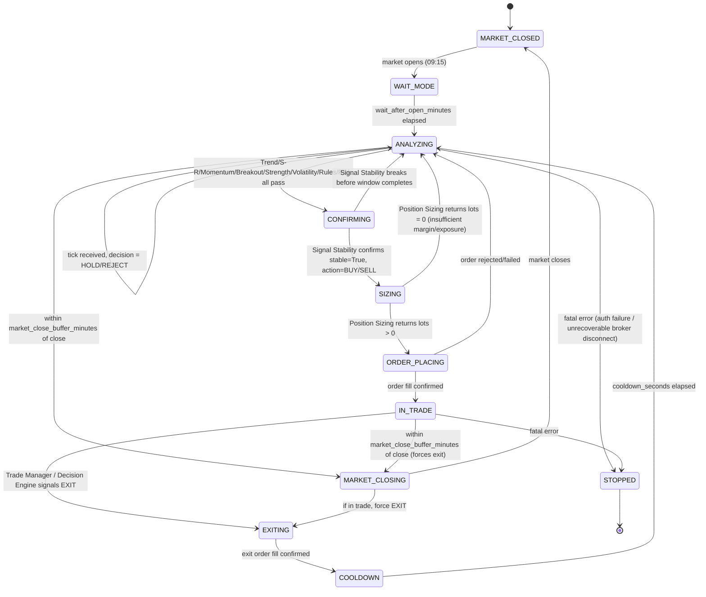
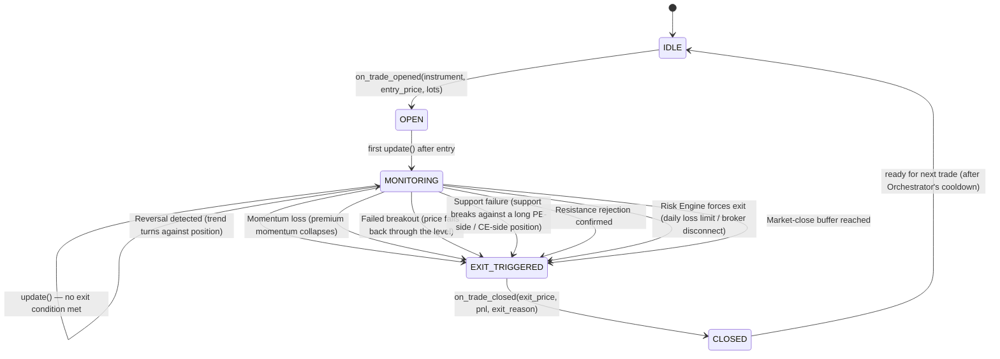

# DESIGN.md — Trading Decision Engine

> Approved. Implementation proceeds exactly per the phased roadmap in §14; any architecture change
> discovered necessary mid-implementation is raised as a question first, never decided silently.

---

## 1. Architecture Overview

A Clean-Architecture trading decision engine, fully independent of the existing root-level bot scripts,
living under `trading_decision_engine/`. It is **event-driven**: a live Groww WebSocket tick is the only
heartbeat — no engine and no orchestrator loop ever polls or sleeps waiting for market data. Fourteen
engines (ten pure market-analysis engines + Signal Stability + Decision + Position Sizing + the stateful
Trade Manager) sit between the market-data layer and the broker execution layer:

```
WebSocket Tick → Snapshot Builder → MarketSnapshot
   → Trend, Market Structure, Support/Resistance, Premium Momentum, Breakout,
     Option Selection, Market Strength, Volatility, Trading Rules, Risk  (10 pure engines)
   → Signal Stability Engine (rolling-history gate)
   → Decision Engine  → Position Sizing Engine
   → Trade Manager  → Groww Execution Adapter
```

Three operating modes share this exact pipeline unmodified (§10, §11): **LIVE** (real ticks, real orders),
**SHADOW** (real ticks, simulated orders — validate before trusting it live), and **REPLAY** (historical
ticks, simulated orders — backtesting). Engines never know which mode is active.

Design principles carried through every layer: each engine is `analyze(input) -> EngineResult` with zero
knowledge of other engines (two narrow, explicit exceptions: Breakout Engine also takes the
Support/Resistance result, and Signal Stability Engine takes a rolling history of other engines' results —
both mediated only by the Orchestrator); every result carries `direction`/`score`/`confidence`/`reasons`;
every threshold is configuration, never a magic number; the broker adapter is the only module that talks to
Groww; and the Trade Manager is the one deliberately stateful analysis-side component.

---

## 2. Folder Structure

```
trading_decision_engine/
  docs/
    DESIGN.md                     # this document
  app/
    models/
      market_snapshot.py           # Candle, PremiumTick, OptionLeg, OptionChainView, SessionState, MarketSnapshot
      engine_results.py             # EngineResult base + all 14 result dataclasses
    config/
      constants.py                  # Direction, TradeAction, MarketStructure, TradeLifecycleState, Index enums
      strategy.py                    # StrategyConfig dataclass + JSON loader (env/secrets kept separate)
    engines/
      base.py                       # Engine(Protocol): analyze(snapshot) -> EngineResult
      trend_engine.py
      market_structure_engine.py
      support_resistance_engine.py
      premium_momentum_engine.py
      signal_stability_engine.py
      option_selection_engine.py
      breakout_engine.py
      market_strength_engine.py
      volatility_engine.py
      risk_engine.py
      trading_rules_engine.py
      decision_engine.py
      position_sizing_engine.py
      trade_manager.py
    market_data/
      market_data_source.py         # Protocol: start(on_snapshot), stop()
      groww_websocket_source.py       # LIVE/SHADOW: GrowwFeed subscriptions -> snapshot_builder -> on_snapshot
      replay_source.py                 # REPLAY: same protocol, replays historical ticks at configurable speed
      snapshot_builder.py               # pure: raw ticks + candle window + option chain -> MarketSnapshot
      historical_replay_builder.py       # reconstructs a replay tick sequence from historical candles
      manual_trade_importer.py            # reads a CSV/JSONL of manual trades -> ManualTradeRecord tuple (§11a)
      decision_comparator.py               # DecisionComparator.compare(...) -> ComparisonReport (§11a)
    broker/
      groww_execution_adapter.py     # login, feed start/stop, place/cancel/status/trades, positions, margins,
                                        # option chain, historical candles — DRY_RUN-aware (used by SHADOW/REPLAY)
    utils/
      indicator_math.py              # sma/wma/ema/EHMA/EMA100, pivot high/low, valuewhen — ported from the .pine
      structure_math.py               # swing-point / HH-HL-LH-LL / double-top-bottom / compression-expansion
      rolling_history.py                # bounded per-engine result history keyed by time window (Signal Stability)
      decision_logger.py                 # CSV + JSON decision/trade logger, mode-tagged (live/shadow/replay)
      error_handling.py                   # safe_analyze() wrapper, RetryPolicy
    orchestrator.py                   # event-driven state machine + composition root
    run.py                            # entrypoint: `python -m trading_decision_engine.app.run --mode live|shadow|replay [--replay-file F] [--replay-speed N]`
  config/
    strategy.json                     # default thresholds/weights/intervals (no secrets)
  reference/
    tw_all_in_one_indicator.pine      # checked in verbatim from the user's spec
  tests/
    fixtures.py
    test_indicator_math.py
    test_structure_math.py
    test_trend_engine.py
    test_market_structure_engine.py
    test_support_resistance_engine.py
    test_premium_momentum_engine.py
    test_signal_stability_engine.py
    test_option_selection_engine.py
    test_breakout_engine.py
    test_market_strength_engine.py
    test_volatility_engine.py
    test_risk_engine.py
    test_trading_rules_engine.py
    test_decision_engine.py
    test_position_sizing_engine.py
    test_trade_manager.py
    test_orchestrator_state_machine.py
    test_error_handling.py
    test_decision_comparator.py
  logs/
    .gitkeep
```

---

## 3. Engine Responsibilities and I/O Contracts

Every result extends: `EngineResult(direction: Direction, score: float, confidence: float, reasons: tuple[str, ...])`.

| # | Engine | Input | Output | Responsibility |
|---|--------|-------|--------|-----------------|
| 1 | `TrendEngine` | `MarketSnapshot` (candles) | `TrendResult` | EHMA(16) vs EMA(100) direction, per the Pine script exactly (no crossover logic). |
| 2 | `MarketStructureEngine` | `MarketSnapshot` (candles) | `MarketStructureResult` | HH/HL/LH/LL, double top/bottom, sideways range, compression/expansion, trend exhaustion from swing points. |
| 3 | `SupportResistanceEngine` | `MarketSnapshot` (candles, spot) | `SupportResistanceResult` | Faithful port of `reference/tw_all_in_one_indicator.pine`: EHMA/EMA100 bands, pivot high/low (left=33,right=21), quick pivots (right=3), Level1–Level14 via `valuewhen`, nearest support/resistance, distances, breakout/breakdown flags. |
| 4 | `PremiumMomentumEngine` | `MarketSnapshot` (premium_history, ~3s) | `PremiumMomentumResult` | Velocity, acceleration, higher-highs/higher-lows, momentum score, trend consistency of ATM premium. |
| 5 | `OptionSelectionEngine` | `MarketSnapshot` (spot, option_chain) | `OptionSelectionResult` | Best tradable CE/PE strike by premium-range fit, liquidity (OI+volume), spread. |
| 6 | `BreakoutEngine` | `MarketSnapshot` (spot) + `SupportResistanceResult` | `BreakoutResult` | Near-resistance/near-support → confirmed breakout/breakdown once price clears and holds `breakout_confirmation_bars`. |
| 7 | `MarketStrengthEngine` | `MarketSnapshot` | `MarketStrengthResult` | Momentum, acceleration, candle speed, range expansion, consolidation, trend confidence. |
| 8 | `VolatilityEngine` | `MarketSnapshot` | `VolatilityResult` | Rejects on spread too high, abnormal volatility, price spikes, gaps, whipsaws. |
| 9 | `TradingRulesEngine` | `SessionState` + `timestamp` + `StrategyConfig` (independent of market analysis) | `TradingRulesResult` | Max trades/day, cooldown between trades, consecutive-loss limit, daily loss limit, daily profit lock, max exposure, expiry-day rules, market-close-proximity rules. |
| 10 | `RiskEngine` | `SessionState` | `RiskResult` | Operational safety only: already-in-trade, order-pending, margin-available, broker-connected. |
| 11 | `SignalStabilityEngine` | `SignalStabilityInput` (rolling history of Trend/Premium/Structure/Breakout/S-R results over an **adaptive** confirmation window, built by the Orchestrator) | `SignalStabilityResult` | Confirms entry conditions held consistently for the full (adaptive) window before allowing BUY/SELL; fails safe (`stable=False`) on disagreement or incomplete history. Required window is computed per §3b, not a fixed constant. |
| 12 | `DecisionEngine` | `DecisionInput` (bundle of all above results) | `EligibilityResult` then `DecisionResult` | **Two-stage** (§3c): Stage 1 checks mandatory eligibility (trend confirmation, signal stability, trading rules, risk, S/R validation, volatility validation) — any failure short-circuits to `REJECT` with reasons. Stage 2 (only if Stage 1 passes) computes weighted buy/sell/exit scores, `confidence`, `action`, and an analytics-only `trade_quality_score` (0-100). |
| 13 | `PositionSizingEngine` | `PositionSizingInput` (`DecisionResult`, `OptionSelectionResult`, `RiskResult`, `StrategyConfig`) | `PositionSizeResult` | *How much* to trade, via pluggable `SizingStrategy` (`FixedLotSizingStrategy` now; `ConfidenceBasedSizingStrategy` as a documented future extension). |
| 14 | `TradeManager` (stateful) | `update(snapshot, decision)` each tick while a trade is open; `on_trade_opened(instrument, entry_price, lots, entry_context)` | `TradeState` | Tracks entry price, current price, highest/lowest premium, current profit/loss, time in trade, highest/lowest spot; detects reversal, momentum loss, failed breakout, support failure, resistance rejection, forced exit. Stores the full `EntryContext` (§3a) captured at entry for later replay analysis. |

Only the Orchestrator knows about more than one engine.

### 3a. Entry Context Capture

At the moment a trade opens, the Orchestrator builds an `EntryContext` (§4) from every engine result already
computed that cycle — trend score, market structure, S/R distances, premium momentum, breakout status,
market strength, volatility, the Stage-1/Stage-2 decision scores, `trade_quality_score`, and the full
decision `reasons` — and hands it to `TradeManager.on_trade_opened(...)`. It rides into the `trade_opened`
JSON event (§8) so every historical trade can be fully reconstructed and analyzed in Replay Mode without
re-running the engines.

### 3b. Adaptive Signal Stability Window

`SignalStabilityEngine` no longer uses a fixed `signal_stability_window_seconds`. Instead the Orchestrator
computes the *required* confirmation window per cycle from the current Trend and Premium Momentum strength:

```python
def required_confirmation_seconds(trend: TrendResult, momentum: PremiumMomentumResult, config: StrategyConfig) -> float:
    strength = (trend.trend_strength + momentum.consistency) / 2.0    # 0-100 combined conviction
    if strength >= config.signal_stability_strong_threshold:
        return config.signal_stability_min_seconds        # strong trend + strong momentum -> confirm fast
    if strength <= config.signal_stability_weak_threshold:
        return config.signal_stability_max_seconds          # sideways/slow market -> wait longer
    # linear interpolation between min and max across the mid-band
    span = config.signal_stability_weak_threshold - config.signal_stability_strong_threshold
    t = (strength - config.signal_stability_strong_threshold) / span
    return config.signal_stability_min_seconds + t * (config.signal_stability_max_seconds - config.signal_stability_min_seconds)
```

Default configuration keeps the effective window at the previous fixed value (base **3.0s**, bounded
`[1.5s, 6.0s]`) until tuned. `SignalStabilityResult.required_seconds` now reflects this computed value per
cycle, not a config constant, so it's directly visible in logs.

### 3c. Two-Stage Decision Process

`DecisionEngine.decide(inputs) -> DecisionResult` internally runs two stages instead of one flat threshold:

1. **Stage 1 — Mandatory Eligibility** (`_check_eligibility`): every one of trend confirmation, signal
   stability (`stable=True`), trading rules (`allowed=True`), risk (`safe_to_trade=True`), support/resistance
   validation (sufficient `distance_to_resistance`/`distance_to_support`), and volatility validation
   (`acceptable=True`) must pass. Returns `EligibilityResult(passed, reasons, failed_checks)`. Any failure
   short-circuits straight to `DecisionResult(action=REJECT, reasons=eligibility.reasons, ...)` — Stage 2
   never runs, and no market/premium score is even computed for a rejected cycle.
2. **Stage 2 — Trade Quality Scoring** (`_score_quality`, only reached if Stage 1 passed): computes weighted
   `buy_score`/`sell_score`/`exit_score` from market_structure, premium_momentum, breakout, option_selection,
   and market_strength (the "quality" dimensions, as opposed to the pass/fail "eligibility" dimensions from
   Stage 1), compares against `decision_score_threshold` to pick `action` (BUY/SELL/HOLD), and additionally
   computes `trade_quality_score` (0-100, §3d) purely for analytics/replay — it does not gate execution.

This mirrors manual trading: first confirm the setup is even valid, only then judge how good it is.

### 3d. Trade Quality Score

`trade_quality_score` (0-100, on `DecisionResult`) is a weighted composite of the Stage-2 quality dimensions
plus `SignalStabilityResult.confirmation_seconds_elapsed` (faster-than-required confirmation scores higher)
and `OptionSelectionResult` liquidity/spread scores. It is analytics-only: 96 = excellent setup, 91 = strong,
84 = average, 70 = weak — used to compare high-quality vs. average trades during offline optimization
(Replay Mode), never to gate whether a trade executes (that remains Stage 1 + `decision_score_threshold`).

---

## 4. Dataclasses and Models

```python
# models/market_snapshot.py
@dataclass(frozen=True)
class Candle:
    ts: datetime; open: float; high: float; low: float; close: float; volume: int

@dataclass(frozen=True)
class PremiumTick:
    ts: datetime; ce_premium: float; pe_premium: float; bid: float; ask: float

@dataclass(frozen=True)
class OptionLeg:
    trading_symbol: str; ltp: float; open_interest: int; volume: int
    bid: float; ask: float; iv: float; delta: float

@dataclass(frozen=True)
class OptionChainView:
    underlying_ltp: float
    strikes: dict[float, dict[str, OptionLeg | None]]   # {strike: {"CE": leg|None, "PE": leg|None}}

@dataclass(frozen=True)
class SessionState:
    already_in_trade: bool; order_pending: bool; margin_available: float; broker_connected: bool
    trades_today: int; consecutive_losses: int; daily_pnl: float; current_exposure: float
    cooldown_until: datetime | None

@dataclass(frozen=True)
class MarketSnapshot:
    timestamp: datetime; spot: float
    candles: tuple[Candle, ...]; premium_history: tuple[PremiumTick, ...]
    option_chain: OptionChainView; session: SessionState
```

```python
# models/engine_results.py
@dataclass(frozen=True)
class EngineResult:
    direction: Direction; score: float; confidence: float; reasons: tuple[str, ...]

@dataclass(frozen=True)
class TrendResult(EngineResult):
    ehma_value: float; ema100_value: float; trend_angle: float; trend_strength: float

@dataclass(frozen=True)
class MarketStructureResult(EngineResult):
    structure: MarketStructure; strength: float   # HH_HL|LH_LL|DOUBLE_TOP|DOUBLE_BOTTOM|SIDEWAYS|COMPRESSION|EXPANSION|EXHAUSTION

@dataclass(frozen=True)
class SupportResistanceResult(EngineResult):
    levels: tuple[float, ...]; nearest_support: float; nearest_resistance: float
    distance_to_support: float; distance_to_resistance: float; breakout: bool; breakdown: bool

@dataclass(frozen=True)
class PremiumMomentumResult(EngineResult):
    velocity: float; acceleration: float; higher_highs: bool; higher_lows: bool; consistency: float

@dataclass(frozen=True)
class OptionSelectionResult(EngineResult):
    best_ce_symbol: str | None; best_pe_symbol: str | None
    ce_premium: float | None; pe_premium: float | None
    ce_liquidity_score: float; pe_liquidity_score: float; ce_spread_score: float; pe_spread_score: float

@dataclass(frozen=True)
class BreakoutResult(EngineResult):
    breakout_confirmed: bool; breakdown_confirmed: bool; confirmation_bars_elapsed: int

@dataclass(frozen=True)
class MarketStrengthResult(EngineResult):
    candle_speed: float; range_expansion: float; consolidation_score: float; trend_confidence: float

@dataclass(frozen=True)
class VolatilityResult(EngineResult):
    acceptable: bool; spread_pct: float; spike_score: float; gap_detected: bool; whipsaw_detected: bool

@dataclass(frozen=True)
class TradingRulesResult(EngineResult):
    allowed: bool; trades_today: int; consecutive_losses: int; is_expiry_day: bool; near_market_close: bool

@dataclass(frozen=True)
class RiskResult(EngineResult):
    safe_to_trade: bool; already_in_trade: bool; order_pending: bool; broker_connected: bool

@dataclass(frozen=True)
class SignalStabilityResult(EngineResult):
    stable: bool; confirmation_seconds_elapsed: float; required_seconds: float   # required_seconds is adaptive, see §3b

@dataclass(frozen=True)
class EligibilityResult:
    passed: bool; reasons: tuple[str, ...]; failed_checks: tuple[str, ...]

@dataclass(frozen=True)
class DecisionResult(EngineResult):
    action: TradeAction; buy_score: float; sell_score: float; exit_score: float   # BUY|SELL|EXIT|HOLD|REJECT
    eligibility: EligibilityResult
    trade_quality_score: float    # 0-100, analytics-only, never gates execution — see §3d

@dataclass(frozen=True)
class PositionSizeResult(EngineResult):
    lots: int; capital_allocated: float; margin_required: float; risk_percentage_used: float

@dataclass(frozen=True)
class EntryContext:
    """Full engine snapshot captured at trade-open time, for replay analysis. See §3a."""
    trend: TrendResult; market_structure: MarketStructureResult; support_resistance: SupportResistanceResult
    premium_momentum: PremiumMomentumResult; breakout: BreakoutResult; market_strength: MarketStrengthResult
    volatility: VolatilityResult; decision: DecisionResult

@dataclass(frozen=True)
class TradeState:
    state: TradeLifecycleState   # OPEN|MONITORING|EXIT_TRIGGERED|CLOSED
    entry_price: float; current_price: float; highest_premium: float; lowest_premium: float
    current_profit: float; current_loss: float; time_in_trade_seconds: float
    highest_spot: float; lowest_spot: float; exit_reason: str | None
    entry_context: EntryContext | None    # populated once the trade opens, carried through to CLOSED

@dataclass(frozen=True)
class ManualTradeRecord:
    """One manually-executed trade, imported for replay comparison. See §11a."""
    timestamp: datetime; instrument: str; action: TradeAction; price: float; lots: int

@dataclass(frozen=True)
class ComparisonReport:
    """Bot-decision vs. manual-trade agreement over a replay run. See §11a."""
    total_bot_decisions: int; total_manual_trades: int
    matched: tuple[tuple[DecisionResult, ManualTradeRecord], ...]
    bot_only: tuple[DecisionResult, ...]; manual_only: tuple[ManualTradeRecord, ...]
    agreement_pct: float
```

```python
# config/strategy.py
@dataclass(frozen=True)
class StrategyConfig:
    option_chain_refresh_seconds: float = 3.0
    candle_interval: str = "1minute"
    decision_score_threshold: float = 85.0
    momentum_threshold: float = 0.05
    trend_threshold: float = 60.0
    min_resistance_distance: float = 15.0
    breakout_confirmation_bars: int = 2
    signal_stability_base_seconds: float = 3.0       # documented default; effective window is adaptive, see §3b
    signal_stability_min_seconds: float = 1.5
    signal_stability_max_seconds: float = 6.0
    signal_stability_strong_threshold: float = 75.0   # combined trend+momentum strength >= this -> min window
    signal_stability_weak_threshold: float = 35.0      # combined strength <= this -> max window
    premium_min: float = 60.0
    premium_max: float = 250.0
    max_spread_pct: float = 2.0
    liquidity_min_oi: int = 50_000
    liquidity_min_volume: int = 10_000
    max_trades_per_day: int = 6
    cooldown_seconds: int = 20
    consecutive_loss_limit: int = 3
    daily_loss_limit: float = 5_000.0
    daily_profit_lock: float = 10_000.0
    max_exposure: float = 100_000.0
    default_lots: int = 1
    expiry_day_cutoff_hour: int = 14
    market_close_buffer_minutes: int = 15
    wait_after_open_minutes: int = 5

    # Previously-hardcoded engine constants, moved into config per an audit finding —
    # every one of these has an identical-valued module-level default still exposed for
    # test/fixture convenience (e.g. VolatilityEngine's MIN_CANDLES), but the engines
    # themselves always read the live StrategyConfig value below, never the constant.
    premium_momentum_min_samples: int = 6
    premium_velocity_scale: float = 40.0
    volatility_min_candles: int = 20
    volatility_range_lookback: int = 15
    volatility_spike_multiplier: float = 2.5
    volatility_gap_multiplier: float = 1.5
    volatility_abnormal_multiplier: float = 2.0
    volatility_whipsaw_window: int = 6
    volatility_whipsaw_min_reversals: int = 4
    structure_swing_left: int = 3
    structure_swing_right: int = 3
    structure_min_candles: int = 30
    structure_exhaustion_threshold: float = 40.0
    structure_double_tolerance_pct: float = 0.15
    structure_compression_lookback: int = 20
    structure_compression_ratio: float = 0.6
    structure_expansion_ratio: float = 1.6
    market_strength_window: int = 10

    weights: dict[str, float] = field(default_factory=lambda: {
        "trend": 0.15, "market_structure": 0.15, "support_resistance": 0.15,
        "premium_momentum": 0.15, "option_selection": 0.05, "breakout": 0.15,
        "market_strength": 0.10, "volatility": 0.05, "trading_rules": 0.025, "risk": 0.025,
    })
```

---

## 5. Sequence Diagram

```mermaid
sequenceDiagram
    participant WS as Groww WebSocket (GrowwFeed)
    participant SB as Snapshot Builder
    participant O as Orchestrator
    participant ENG as 10 Pure Engines
    participant SS as Signal Stability Engine
    participant DE as Decision Engine
    participant PS as Position Sizing Engine
    participant TM as Trade Manager
    participant EX as Groww Execution Adapter

    WS->>SB: tick (LTP / depth / index update)
    SB->>SB: merge tick + rolling candle window + cached option chain
    SB->>O: MarketSnapshot (immutable)
    O->>ENG: analyze(snapshot) [Trend, Structure, S/R, Premium, Breakout(+SR), OptionSel, Strength, Volatility, Rules, Risk]
    ENG-->>O: 10 EngineResults
    O->>O: append Trend/Premium/Structure/Breakout/S-R results to rolling history
    O->>O: compute adaptive required_seconds from Trend + Premium strength (§3b)
    O->>SS: analyze(history window of required_seconds)
    SS-->>O: SignalStabilityResult
    O->>DE: Stage 1 — check_eligibility(all 11 results)
    DE-->>O: EligibilityResult(passed, reasons, failed_checks)
    alt Stage 1 failed
        O->>O: DecisionResult(action=REJECT, reasons=eligibility.reasons); log rejection; await next tick
    else Stage 1 passed
        O->>DE: Stage 2 — score_quality(market_structure, premium_momentum, breakout, option_selection, market_strength)
        DE-->>O: DecisionResult(action, confidence, buy/sell/exit_score, trade_quality_score, reasons)
    end
    alt action in (BUY, SELL)
        O->>PS: size(decision, option_selection, risk, config)
        PS-->>O: PositionSizeResult(lots, capital, margin)
        O->>EX: place_order(side, instrument, lots)
        EX-->>O: order result
        O->>O: build EntryContext from this cycle's 10 results + DecisionResult (§3a)
        O->>TM: on_trade_opened(instrument, entry_price, lots, entry_context)
    else action == EXIT
        O->>EX: place_order(SELL, instrument, lots)
        O->>TM: on_trade_closed(...)
        O->>O: start cooldown timer
    else action in (HOLD, REJECT)
        O->>O: log rejection reasons, await next tick
    end
    opt trade currently open
        O->>TM: update(snapshot, decision)
        TM-->>O: TradeState (may force EXIT next cycle)
    end
```

---

## 6. State Diagram — Orchestrator (overall trading-day flow)



## 6b. State Diagram — Trade Manager (single-trade lifecycle)



Each `EXIT_TRIGGERED` transition sets `TradeState.exit_reason` to the specific human-readable cause (one of
the six above), which flows straight into the JSON event log (§8) and the Decision Engine's next-cycle EXIT
reasoning.

---

## 7. Configuration Parameters

All in `config/strategy.json` → `StrategyConfig` (§4), optionally overlaid by a profile from
`config/profiles/<name>.json` (`active_profile` key or `--profile` flag; shipped profiles: aggressive,
balanced, conservative, scalping). Config edits live-reload within `config_reload_check_seconds` without a
restart. **The complete, current parameter reference — every engine threshold, Stage-1 gate toggle
(`require_*`), Stage-2 threshold, weight, and operational timing — lives in `config/README.md`;** the table
below documents the original core set. No thresholds hardcoded in engine code. Secrets (`GROWW_API_KEY`,
`GROWW_TOTP_SECRET`) load from env vars first, then repo-root `ai_config.json`, never committed.

| Parameter | Type | Default | Description |
|---|---|---|---|
| `option_chain_refresh_seconds` | float | 3.0 | Bounded pull interval for option chain (no push feed exists). |
| `candle_interval` | str | `"1minute"` | Candle interval backing Trend/S-R/Structure engines. |
| `decision_score_threshold` | float | 85.0 | Minimum buy/sell score to act. |
| `momentum_threshold` | float | 0.05 | Minimum CE-PE spread velocity (premium-points/sec) to call the premium genuinely "rising"/"falling" rather than noise around zero. |
| `trend_threshold` | float | 60.0 | Minimum trend score to consider "bullish"/"bearish". |
| `min_resistance_distance` | float | 15.0 | Minimum points of headroom to nearest resistance to enter long. |
| `breakout_confirmation_bars` | int | 2 | Bars price must hold beyond a level to confirm breakout/breakdown. |
| `signal_stability_base_seconds` | float | 3.0 | Documented default confirmation window; effective window is adaptive (§3b). |
| `signal_stability_min_seconds` / `_max_seconds` | float | 1.5 / 6.0 | Bounds of the adaptive confirmation window. |
| `signal_stability_strong_threshold` / `_weak_threshold` | float | 75.0 / 35.0 | Combined trend+momentum strength bands that select min/max window. |
| `premium_min` / `premium_max` | float | 60.0 / 250.0 | Tradable premium range for Option Selection Engine. |
| `max_spread_pct` | float | 2.0 | Max bid/ask spread (% of premium) considered liquid. |
| `liquidity_min_oi` / `liquidity_min_volume` | int | 50000 / 10000 | Minimum OI/volume for a strike to be selectable. |
| `max_trades_per_day` | int | 6 | Trading Rules Engine cap. |
| `cooldown_seconds` | int | 20 | Cooldown after every exit. |
| `consecutive_loss_limit` | int | 3 | Stop trading after N consecutive losses. |
| `daily_loss_limit` | float | 5000.0 | Stop trading once daily loss reaches this (₹). |
| `daily_profit_lock` | float | 10000.0 | Stop trading once daily profit reaches this (₹). |
| `max_exposure` | float | 100000.0 | Max capital deployed at once. |
| `default_lots` | int | 1 | `FixedLotSizingStrategy` output. |
| `expiry_day_cutoff_hour` | int | 14 | Hour (IST, 24h) after which expiry-day rules tighten. |
| `market_close_buffer_minutes` | int | 15 | Force-exit/no-new-entry buffer before close. |
| `wait_after_open_minutes` | int | 5 | `WAIT_MODE` duration after market open. |
| `premium_momentum_min_samples` | int | 6 | Minimum premium ticks before PremiumMomentumEngine reports anything but neutral. |
| `premium_velocity_scale` | float | 40.0 | CE-PE spread velocity (points/sec) that maps to a momentum score of 100. |
| `volatility_min_candles` | int | 20 | Minimum candles before VolatilityEngine reports anything but rejecting. |
| `volatility_range_lookback` | int | 15 | Candle window for recent/longer average-range comparisons. |
| `volatility_spike_multiplier` / `_gap_multiplier` / `_abnormal_multiplier` | float | 2.5 / 1.5 / 2.0 | Multiples of average range that flag a spike / gap / abnormal-volatility regime. |
| `volatility_whipsaw_window` / `_whipsaw_min_reversals` | int | 6 / 4 | Candles inspected and minimum directional reversals to flag a whipsaw. |
| `structure_swing_left` / `_swing_right` | int | 3 / 3 | Pivot lookback/lookahead for swing-point detection in MarketStructureEngine. |
| `structure_min_candles` | int | 30 | Minimum candles before MarketStructureEngine classifies structure. |
| `structure_exhaustion_threshold` | float | 40.0 | Minimum exhaustion strength to override HH_HL/LH_LL with EXHAUSTION. |
| `structure_double_tolerance_pct` | float | 0.15 | Swing-height tolerance (%) to call two swings a double top/bottom. |
| `structure_compression_lookback` | int | 20 | Candle window for compression/expansion range-ratio comparison. |
| `structure_compression_ratio` / `_expansion_ratio` | float | 0.6 / 1.6 | Recent/prior range ratio thresholds for COMPRESSION / EXPANSION. |
| `market_strength_window` | int | 10 | Candle window MarketStrengthEngine compares recent-vs-prior. |
| `weights` | dict[str, float] | see §4 | Per-engine contribution to buy/sell/exit scoring. |
| `mode` | str (CLI) | `live` | `live` \| `shadow` \| `replay` — selects data source + execution behaviour (§10, §11). |

---

## 8. Logging Format

**CSV** — `logs/decisions_YYYY-MM-DD.csv`, one row per decision cycle:
```
timestamp,mode,spot,ce_premium,pe_premium,trend_score,structure_score,sr_score,momentum_score,
stability_stable,stability_required_seconds,option_ce_symbol,option_pe_symbol,breakout_confirmed,
market_strength_score,volatility_acceptable,rules_allowed,risk_safe,eligibility_passed,action,
buy_score,sell_score,exit_score,confidence,trade_quality_score,reasons,exit_reason
```

**JSON (JSONL)** — `logs/events_YYYY-MM-DD.jsonl`, one structured event per line, always mode-tagged:
```json
{"event": "decision", "mode": "live", "timestamp": "...", "action": "BUY", "confidence": 92.0, "trade_quality_score": 91.0, "reasons": ["Strong Trend", "Premium Rising", "Structure Bullish", "Resistance Far", "Good Liquidity", "Acceptable Volatility"]}
{"event": "rejected", "mode": "shadow", "timestamp": "...", "stage": "eligibility", "reasons": ["Signal Stability: only 1.8s/3.1s required (adaptive)", "Trading Rules: max trades/day reached"]}
{"event": "trade_opened", "mode": "live", "timestamp": "...", "instrument": "NIFTY26JUN23800CE", "entry_price": 152.4, "lots": 1, "entry_context": {"trend_score": 78.0, "structure": "HH_HL", "sr_distance_to_resistance": 42.0, "premium_momentum_velocity": 1.8, "breakout_confirmed": true, "market_strength_score": 81.0, "volatility_acceptable": true, "decision_confidence": 92.0, "trade_quality_score": 91.0, "reasons": ["Strong Trend", "Premium Rising"]}}
{"event": "trade_closed", "mode": "live", "timestamp": "...", "instrument": "NIFTY26JUN23800CE", "exit_price": 168.1, "pnl": 1177.5, "exit_reason": "Resistance Rejection"}
```
The `mode` tag lets shadow-mode runs be compared against live/manual trades without contaminating real
trade history; the `entry_context` block on `trade_opened` is the serialized `EntryContext` (§3a/§4) so every
historical trade can be fully reconstructed and analyzed in Replay Mode without re-running the engines. Both
writers live in `utils/decision_logger.py`.

---

## 9. Error Handling Strategy

- **Broker adapter**: REST calls retried with bounded exponential backoff; HTTP 429 → sleep-and-retry per
  Groww's documented rate limit; HTTP 401 → one re-login attempt, then raise (fatal, not swallowed).
  WebSocket disconnects trigger auto-reconnect with backoff and re-subscription; `SessionState.broker_connected`
  is set `False` until reconnected, which the Risk Engine reads to block new entries.
- **Engines**: pure functions never raise on normal bad-but-valid data (sparse history, missing strike) —
  they return a low-confidence/neutral `EngineResult` with a `reasons` entry explaining why. Only programmer
  errors propagate.
- **Orchestrator**: wraps each engine call via `error_handling.safe_analyze(...)`; one engine's unexpected
  exception is logged and substituted with a neutral result — never crashes the tick pipeline. Repeated
  failures from the same engine escalate (log + alert hook) and pause new entries while still monitoring any
  open trade.
- **Execution/Trade Manager**: a failed **exit** order retries immediately and escalates to an alert if still
  failing — a stuck open position is the highest-risk failure mode and is never silently dropped.

---

## 10. Replay Mode Architecture

- `ReplayMarketDataSource` implements the same `MarketDataSource` protocol as the live source — the
  Orchestrator and every engine are unaware of the difference.
- `HistoricalReplayBuilder` reconstructs a tick sequence from the broker adapter's `get_historical_candles`
  plus periodic historical option-chain snapshots, synthesizing `PremiumTick`/`Candle` samples through the
  **same `snapshot_builder`** used live — guaranteeing an identical `MarketSnapshot` shape.
- `--replay-speed N`: `0` = as-fast-as-possible (backtesting), `1.0` = real-time pacing, values between scale
  proportionally.
- Replay mode forces `DRY_RUN=True` — never touches order/position/margin endpoints, read-only against
  historical data.

---

## 11. Shadow Mode Architecture

Shadow mode validates the engine against **real live market data** before it is trusted to place real
orders — it reuses the exact same `GrowwWebSocketMarketDataSource` as LIVE mode (so it reacts to genuine
ticks, not synthetic ones), but the broker adapter is forced into `DRY_RUN=True` exactly as in REPLAY mode:
simulated fills against the real last-known LTP, fake order IDs, no real capital ever at risk.

| Mode | Data source | Order execution | Purpose |
|---|---|---|---|
| `live` | `GrowwWebSocketMarketDataSource` | Real (`DRY_RUN=False`) | Production trading. |
| `shadow` | `GrowwWebSocketMarketDataSource` | Simulated (`DRY_RUN=True`) | Validate live decisions/timing against real ticks without risking capital — logs everything the engine *would* have done, tagged `"mode": "shadow"`, for side-by-side comparison against manual trades or other bots. |
| `replay` | `ReplayMarketDataSource` | Simulated (`DRY_RUN=True`, forced) | Backtesting against historical data. |

No new orchestrator or engine code is needed for shadow mode — it is purely a combination of the existing
live data source with the existing `DRY_RUN` flag, selected via `run.py --mode shadow`. This is why the
`MarketDataSource` protocol and the broker adapter's `DRY_RUN` awareness (§10) are designed as orthogonal
axes from the start.

### 11a. Replay Comparison Support (architecture only — no UI)

Replay Mode is extended to optionally compare the bot's decisions against manually-recorded trades, to
measure agreement before trusting the bot live:

- `ManualTradeRecord` (§4) — one manual trade: `timestamp`, `instrument`, `action`, `price`, `lots`.
- `ManualTradeImporter` (`market_data/manual_trade_importer.py`) — reads a CSV/JSONL file of manual trades
  (format compatible with the existing `Lakshmi.xlsx`/trade-history logging conventions elsewhere in the
  repo) into a `tuple[ManualTradeRecord, ...]`. Not built in v1 beyond the loader — no import UI is required
  now, per the user's instruction; it's a plain file-read utility.
- `DecisionComparator.compare(bot_decisions: tuple[DecisionResult, ...], manual_trades: tuple[ManualTradeRecord, ...], tolerance_seconds: float) -> ComparisonReport` —
  matches each manual trade to the nearest bot `DecisionResult` for the same instrument within
  `tolerance_seconds`, and reports `matched`, `bot_only` (bot traded, no matching manual trade),
  `manual_only` (manual trade, bot didn't act), and `agreement_pct = len(matched) / total_manual_trades`.
- This runs only in Replay Mode, only when a manual-trades file is supplied via `run.py --mode replay
  --manual-trades <file>`; it is entirely optional and orthogonal to the rest of the pipeline — the
  Orchestrator and engines have no awareness of it. Output is a `ComparisonReport` printed/logged at the end
  of the replay run (JSON), not a live feature.

---

## 12. Broker Adapter Interface

```python
# broker/groww_execution_adapter.py — the only module allowed to hold broker/session/network logic
class GrowwExecutionAdapter:
    def login(self) -> None: ...                                    # api_key + TOTP -> GrowwAPI + GrowwFeed
    def start_feed(self, instruments: list[dict], on_tick: Callable[[TickEvent], None]) -> None: ...
    def stop_feed(self) -> None: ...
    def get_option_chain(self, index: str, expiry_date: str) -> OptionChainView: ...
    def get_historical_candles(self, symbol: str, interval: str, start: datetime, end: datetime) -> tuple[Candle, ...]: ...
    def place_order(self, instrument: dict, quantity: int, side: Literal["BUY", "SELL"], product: str = "MIS") -> OrderResult: ...
    def cancel_order(self, order_id: str) -> bool: ...
    def get_order_status(self, order_id: str) -> str: ...
    def get_order_executed_price(self, order_id: str) -> tuple[float, int]: ...
    def get_positions(self) -> tuple[PositionView, ...]: ...
    def get_margins(self) -> MarginView: ...
    def is_connected(self) -> bool: ...
```

- Credentials: `GROWW_API_KEY`/`GROWW_TOTP_SECRET` env vars first, then repo-root `ai_config.json`, never hardcoded.
- `DRY_RUN`: mirrors PROD10FEB's paper-trading pattern (simulated fills, fake order IDs) — drives SHADOW/REPLAY.
- Same SDK/REST shapes as PROD10FEB (`groww.place_order(...)` with `groww.VALIDITY_DAY`, `EXCHANGE_NSE/BSE`,
  `SEGMENT_FNO`, `PRODUCT_MIS`, `ORDER_TYPE_MARKET`, `TRANSACTION_TYPE_BUY/SELL`; REST for status/trades/
  positions/margins/cancel per `GROWW_API_REFERENCE.md`), plus `GrowwFeed.subscribe_ltp/subscribe_market_depth/
  subscribe_index_value` for the live event source — a fresh, independently-written, clean module, not an
  import of PROD10FEB.

---

## 13. Testing Strategy

Stdlib `unittest`. One file per engine/utility plus the orchestrator and Trade Manager state machines:
- Each engine test builds synthetic `MarketSnapshot`/history fixtures and asserts `direction`/`score`/
  `confidence`/`reasons` plus engine-specific fields across bullish/bearish/sideways, near-resistance/clear-
  room, rising/falling momentum, breakout/no-breakout, strike-selection scoring, high/low volatility, rules-
  blocked/clear, risk-blocked/clear, and decision threshold boundaries.
- `test_signal_stability_engine.py`: fully-stable window → `True`; one disagreeing sample mid-window →
  `False`; insufficient history → `False`.
- `test_position_sizing_engine.py`: fixed-lot sizing respects `max_exposure`/margin caps; strategy swappable.
- `test_error_handling.py`: an engine that raises is caught and substituted with a neutral result.
- `test_orchestrator_state_machine.py`: drives synthetic snapshot sequences through §6's full state diagram
  (wait → analyze → confirm → size → order → in-trade → exit → cooldown; market-close forced-exit; fatal
  error → STOPPED).
- `test_trade_manager.py`: drives §6b's state diagram — each of the six exit triggers independently, the
  steady-state MONITORING loop with no exit condition met, and that `on_trade_opened` correctly stores the
  `EntryContext` (§3a) unmodified through to `CLOSED`.
- `test_decision_engine.py` (expanded): Stage 1 rejects immediately on each individual mandatory-check
  failure (trend/stability/rules/risk/S-R/volatility) without computing Stage 2 at all; Stage 2 only runs
  when Stage 1 passes; `trade_quality_score` varies independently of `action` (a BUY can be quality 70 or 96
  — the score never changes whether the trade executes).
- `test_signal_stability_engine.py` (expanded): `required_confirmation_seconds` (§3b) returns
  `signal_stability_min_seconds` for strong trend+momentum, `signal_stability_max_seconds` for weak/sideways,
  and interpolates in between.
- `test_decision_comparator.py`: matches bot decisions to manual trades within `tolerance_seconds`, computes
  `agreement_pct`, and correctly buckets `bot_only`/`manual_only` cases.

---

## 14. Implementation Roadmap (Phases)

Each phase produces runnable/testable output before the next begins.

| Phase | Deliverable | Depends on |
|---|---|---|
| 0 | This `docs/DESIGN.md`, committed verbatim. **Stop for explicit user approval before any code.** | — |
| 1 | Foundations: `models/`, `config/` (incl. `strategy.json`), `utils/indicator_math.py`, `utils/structure_math.py`, `utils/error_handling.py`, `reference/tw_all_in_one_indicator.pine`. | Phase 0 approved |
| 2 | Pure analysis engines: Trend, Market Structure, Support/Resistance, Premium Momentum, Option Selection, Breakout, Market Strength, Volatility — each with its own unit test using fixtures alone. | Phase 1 |
| 3 | Policy engines: Trading Rules, Risk, Signal Stability — session/history-shaped, still no broker dependency. | Phase 1 |
| 4 | Combination engines: two-stage `DecisionEngine` (§3c) incl. `trade_quality_score` (§3d), `PositionSizingEngine`, `TradeManager` incl. `EntryContext` capture (§3a). | Phase 2, 3 |
| 5 | Data & broker layer: `market_data_source.py`, `groww_execution_adapter.py` (DRY_RUN-first), `snapshot_builder.py`, `groww_websocket_source.py`, `replay_source.py`, `historical_replay_builder.py`. | Phase 1 |
| 6 | Orchestrator & entrypoint: `orchestrator.py` full state machine incl. adaptive stability-window computation (§3b), `run.py` with `--mode live\|shadow\|replay`. | Phase 4, 5 |
| 7 | Replay comparison: `manual_trade_importer.py`, `decision_comparator.py` (§11a). | Phase 6 |
| 8 | Remaining tests: orchestrator state machine, Trade Manager state machine, error handling, decision comparator. | Phase 7 |
| 9 | Verification (§15): full test suite green, one `--mode replay --dry-run` end-to-end pass reviewed against the logs (incl. `entry_context` on a simulated trade). | Phase 8 |

---

## 15. Verification

- `python -m unittest discover trading_decision_engine/tests` — all unit tests pass.
- `python -m trading_decision_engine.app.run --mode replay --replay-file <sample> --replay-speed 0` —
  exercises the full pipeline end-to-end (tick → snapshot → all 14 engines incl. the signal-stability gate →
  decision → position sizing → trade manager → simulated execution → exit → cooldown) without a live broker
  connection or live market hours.
